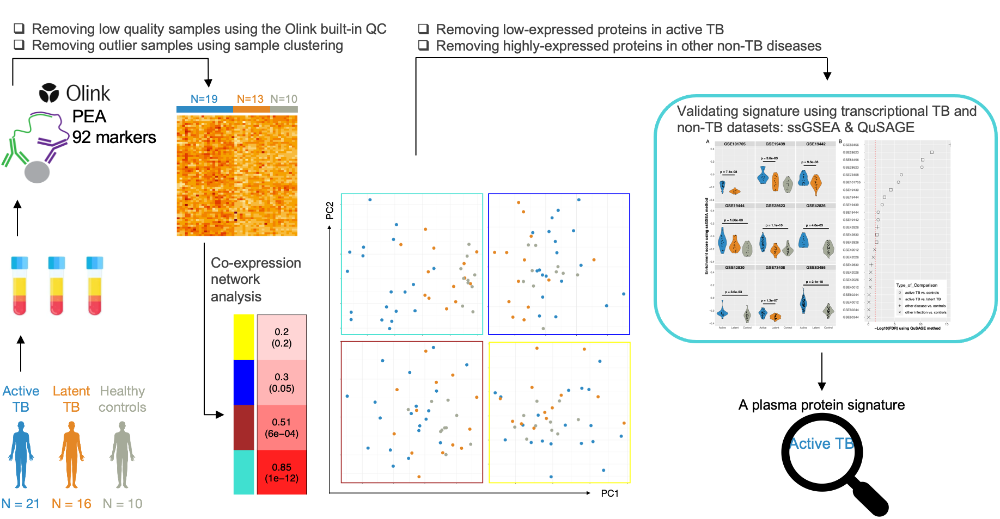

# R code repository for 

## A protein signature associated with active tuberculosis identified by plasma profiling and network-based analysis

[Mousavian et al. medRxiv](https://www.medrxiv.org/content/medrxiv/early/2022/04/22/2022.04.22.22274170.full.pdf)

**Objectives:** Tuberculosis (TB) is a bacterial infectious disease caused by Mycobacterium
tuberculosis. Annually, an estimated 10 million people are diagnosed with active TB, and
approximately 1.4 million dies of the disease. If left untreated, each person with active TB
will infect 10 to 15 new individuals every year. Therefore, interrupting disease transmission
by accurate early detection and diagnosis, paired with appropriate treatment is of major
importance. In this study, we aimed to identify biomarkers associated with the development
of active TB that can then be further developed for clinical testing.

**Methods:** We assessed the relative plasma concentration of 92 proteins associated with
inflammation in individuals with active TB (n=19), latent TB (n=13), or healthy controls
(n=10). We then constructed weighted protein co-expression networks to reveal correlations
between protein expression profiles in all samples. After clustering the networks into four
modules, we assessed their association with active TB.

**Results:** One module consisting of 16 proteins was highly associated with active TB. We
used multiple independent transcriptomic datasets from studies investigating respiratory
infections and non-TB diseases. We then identified and removed genes encoding proteins
within the module that were low expressed in active TB or associated with non-TB diseases,
resulting in a 12-protein plasma signature associated with active TB.

**Conclusion:** We identified a plasma protein signature that is highly enriched in patients with
active TB but not in individuals with latent TB or healthy controls and that also had minimal
cross-reactivity with common viral or bacterial lower respiratory tract infections. 
